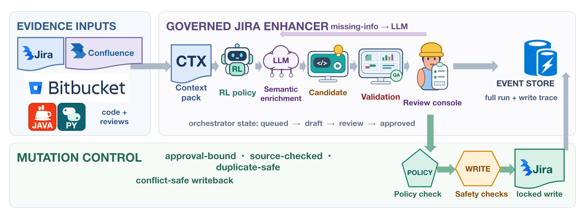

# Jira Enhancer

Jira Enhancer is a governance-aware workflow for turning incomplete Jira issues and epics into reviewable planning artifacts. It gathers linked evidence, scores readiness, selects a bounded prompt policy, produces a draft, and requires explicit human approval before writeback. The repository accompanies the TOSEM manuscript **“Jira Enhancer: A Governance-Aware Human–AI Collaboration System for Epic-to-Story Decomposition in Software Engineering.”**

This is a reviewer-facing artifact. It contains the implementation, tests, API contracts, manuscript source, publication figures, deterministic experiments, and de-identified evidence that can be shared publicly. It does not contain credentials, internal Jira records, reviewer workbooks, reviewer comments, or confidential source packets.



## What is included

```text
.
├── src/jira_enhancer/              # application, connectors, governance, and RL policy code
├── tests/                          # unit, workflow, RL, and transaction-safety tests
├── openapi/                        # external, internal, and event contracts
├── patent/
│   ├── artifacts/tosem/            # de-identified and synthetic reviewer artifacts
│   ├── artifacts/b2_b3_pilot/      # aggregate pilot data and sanitized posterior trace
│   ├── generated/                  # manuscript figures and selected result tables
│   ├── images/                     # architecture and module figures
│   ├── reviewer_study/public_results/
│   ├── reproduce_public_figures.py
│   ├── generate_b2_b3_learning_figure.py
│   ├── run_rl_epoch_simulation.py
│   ├── run_source_bound_transaction_experiment.py
│   ├── verify_public_artifact.py
│   ├── jiraenhancer_tosem_acm.tex
│   └── jiraenhancer_tosem_acm.pdf
├── .env.example                    # placeholders only; never commit a real .env
├── Makefile
└── pyproject.toml
```

## Evidence map and claim boundaries

The paper combines several forms of evidence. They answer different questions and must not be pooled as if they were one experiment.

| Evidence | Public input | Reproduction level | What it supports |
|---|---|---|---|
| Unit and workflow tests | Synthetic fixtures | Fully executable offline | Application behavior and workflow contracts |
| Source-bound transaction experiment | Fixed-seed synthetic fault schedule with 9 scenarios, 2,000 trials, and 4 control arrangements (72,000 observations) | Fully executable offline | Mutation safety under the declared injected faults |
| Authenticated Jira outcome summary | 70 de-identified successful-path endpoints (69 created issues and one safe duplicate) and a 45-item audit | Hash and statistic verification | Feasibility, endpoint counts, and system-produced confidence changes in the reported deployment waves; not confidence calibration or downstream quality |
| B3-only authenticated-output assessment | Restricted reviewer workbooks; aggregate results in the manuscript | Aggregate result inspection only | Absolute assessment of 69 full-text stories and 14 epic packages by two reviewers, with three masked repeats per reviewer; no B1/B2 baseline |
| Matched blinded review | Aggregate de-identified result tables for 42 matched B1/B2/B3 packages, 14 inputs, and 210 stories | Result inspection; raw workbooks are restricted | Ratings, assessment time, and revision decisions from five reviewers; Reviewers 3--5 form the primary comparison because Reviewers 1--2 had prior B3 exposure. B3 assessment time was lower than B2, while their aggregate quality difference was not statistically significant. B2 and B3 used the same model but 14 versus 173 calls, so the study is not compute-matched |
| 5,000-unit B0–B3 analysis | Anonymized formula-expanded units | Released-row verification plus figure and statistic recomputation | Sensitivity of the declared scoring model; row generation is not publicly reproducible, and the rows are not independent field observations |
| SWE-bench Lite analysis | Public issue text | Executable after dataset download | Cross-dataset scoring sensitivity; not patch generation or SWE-bench resolution performance |
| B2/B3 held-out learned-selection diagnostic | Three packets, aggregate scores, learned-state summary, and sanitized posterior trace | Aggregate inspection, posterior-trace validation, and figure reproduction | Six model-evaluator judgments comparing one-pass B2 with learned-arm B3. Both used `gpt-5.6-sol` with ultra reasoning. B3 used up to three refinements and produced output that was 67% longer, so the comparison does not isolate the effect of policy learning |

The raw enterprise inputs are withheld because they contain issue text, URLs, account data, and operational metadata. The completed human-review workbooks are withheld because they contain reviewer-level records and comments. The public files preserve the aggregate evidence used by the manuscript without publishing those records.

## Requirements

- Python 3.11 or newer
- A POSIX shell for the Makefile examples
- A LaTeX distribution with `latexmk` for rebuilding the manuscript
- Network access only for the optional SWE-bench Lite download or live connectors

The core application uses the Python standard library. Research and figure scripts use the `reviewer` dependency group.

## Five-minute reviewer check

Create an isolated environment and install the project:

```bash
python3 -m venv .venv
source .venv/bin/activate
python -m pip install --upgrade pip
python -m pip install -e '.[reviewer]'
```

Run the public artifact verification, the full test suite, the seeded fault
schedule, and public figure regeneration:

```bash
make reviewer-check
```

To run only the manuscript-sized fault schedule, use:

```bash
make fault-injection
```

The reviewer-check outputs are written below `outputs/reproduced/`. The optional public benchmark writes manuscript-ready tables and figures under `patent/generated/`, and `make paper` writes LaTeX build files under `patent/out_tosem/`. The public figure target also rebuilds the learned arm-selection curve from its sanitized posterior trace.

## Run the application with synthetic data

The mock mode requires no Jira account and performs no remote writes.

```bash
export CODEX_CONFIG_PATH="$(pwd)/reviewer_runtime/no-codex-config.toml"
export JIRA_ENHANCER_CONNECTOR_MODE=mock
export JIRA_ENHANCER_REASONING_MODE=heuristic
export JIRA_ENHANCER_USE_CODEX_EXEC=false
export JIRA_ENHANCER_RL_ENABLED=false

PYTHONPATH=src python -m jira_enhancer \
  --storage-root ./reviewer_runtime \
  run \
  --scope-type issue \
  --scope-value DEMO-18324 \
  --requestor reviewer@example.org
```

The global `--storage-root` option must appear before the subcommand. The JSON output contains a `runId`. Use that value in the following commands:

```bash
PYTHONPATH=src python -m jira_enhancer --storage-root ./reviewer_runtime \
  show-run --run-id RUN_ID

PYTHONPATH=src python -m jira_enhancer --storage-root ./reviewer_runtime \
  approve --run-id RUN_ID --issue-key DEMO-18324 \
  --decision approve --reviewer approver@example.org

PYTHONPATH=src python -m jira_enhancer --storage-root ./reviewer_runtime \
  writeback --run-id RUN_ID --issue-key DEMO-18324
```

In mock mode, writeback mutates an in-memory Jira copy for the current process. Run, approval, and writeback audit records persist below `--storage-root`, but a new invocation reloads the bundled fixture.

Start the local UI and API with:

```bash
PYTHONPATH=src python -m jira_enhancer \
  --storage-root ./reviewer_runtime serve --host 127.0.0.1 --port 8080
```

Open <http://127.0.0.1:8080/>. The UI can create a run, inspect candidates, record approval or rejection, request regeneration or user input, execute approved writeback, replay a run, and suggest or create approved stories from an epic. The prompt-learning view is available at <http://127.0.0.1:8080/ui/rl>.

## Workflow

The implementation keeps reasoning separate from mutation:

1. The scope resolver expands an issue, epic, sprint, or release.
2. The scanner reads issue fields and linked evidence.
3. The scorer records readiness, confidence, warnings, and policy flags.
4. When `JIRA_ENHANCER_RL_ENABLED=true`, the prompt service filters policy arms by governance predicates and selects an eligible arm. RL is disabled by default.
5. The reasoning layer creates or refines a candidate draft.
6. Candidate validation checks missing or placeholder acceptance and next-step fields, dependency/evidence alignment, and limited scope contradictions. Duplicate targets are canonicalized.
7. A reviewer records an explicit decision.
8. A source-bound causal envelope binds the source revision, draft, policy, reviewer decision, target set, and idempotency key.
9. Writeback separately checks the run and issue, approved draft, policy snapshot and target fields, source hash or revision, transaction identifier, and idempotency identifier. It proceeds only if the envelope still matches the current state.

The RL component adapts prompt selection. It does not bypass validation, policy, approval, or transaction checks.

## API contracts

Selected HTTP contract documents are in [`openapi/`](openapi/). The implementation provides these principal endpoints:

- `POST /api/v1/runs`
- `GET /api/v1/runs/{runId}`
- `GET /api/v1/runs/{runId}/items/{issueKey}`
- `POST /api/v1/runs/{runId}/items/{issueKey}/approval`
- `POST /api/v1/runs/{runId}/approval`
- `POST /api/v1/runs/{runId}/items/{issueKey}/interaction-answer`
- `POST /api/v1/runs/{runId}/items/{issueKey}/writeback`
- `POST /api/v1/runs/{runId}/writeback`
- `POST /api/v1/replay/{runId}`
- `POST /api/v1/epics/{epicKey}/stories/suggest`
- `POST /api/v1/epics/{epicKey}/stories/create`

The approval contract accepts `approve`, `reject`, `regenerate`, `user_input`, and `prompt`. This allows a reviewer to give a suggestion or a new prompt before a candidate is approved.

## Reproduce the public evidence

### 1. Verify the de-identified Jira artifact

```bash
python patent/verify_public_artifact.py
```

The verifier checks SHA-256 hashes, row counts, wave counts, confidence statistics, creation outcomes, link checks, and audited payload coverage against `patent/artifacts/tosem/analysis_summary.json`.

The verification starts from already de-identified rows. It does not recreate the export from restricted enterprise records.

### 2. Run all application tests

```bash
PYTHONPATH=src python -m unittest discover -s tests -p 'test_*.py' -v
```

Run the transaction tests alone with:

```bash
PYTHONPATH=src python -m unittest tests.test_causal_transaction -v
```

### 3. Reproduce the source-bound transaction experiment

```bash
PYTHONPATH=src python patent/run_source_bound_transaction_experiment.py \
  --output-dir outputs/reproduced/source_bound_transaction \
  --trials-per-scenario 2000 \
  --seed 20260726
```

The experiment applies the same transaction payload and fault schedule to four control arrangements. It writes trial rows, summaries, paired comparisons, an SVG, a LaTeX table, metadata, and checksums. These are scenario-balanced synthetic fault outcomes. They are not estimates of production incident prevalence.

### 4. Rebuild the public figures

```bash
make public-figures
```

This target reads only released files under `patent/artifacts/`. It regenerates the de-identified confidence view, the scoring-model comparison figures, the arm-posterior curve, and the critic-reward heatmap. It does not read `runtime/`.

To rebuild only the learned-selection curve, use:

```bash
PYTHONPATH=src python patent/generate_b2_b3_learning_figure.py \
  --output outputs/reproduced/figures/b2_b3_arm_learning.png \
  --reward-output outputs/reproduced/figures/b2_b3_critic_reward_heatmap.png
```

Both figures are rebuilt from a sanitized 99-step posterior trace. It contains no input identifier or source text. The figures show posterior learning and model-critic rewards. They do not show human-rated quality or delivery performance.

The editable architecture source is `patent/images/system_architecture.drawio`. The four module diagrams and control-flow image are provided as publication-resolution PNG files.

### 5. Inspect the matched-review aggregates

Public aggregate results are under:

```text
patent/reviewer_study/public_results/
```

The directory contains method summaries, paired contrasts, dimension summaries, reliability diagnostics, and resource accounting. It excludes raw ratings, comments, identity mappings, private allocation keys, and workbooks. Therefore, the public release supports inspection of the reported aggregates, not a fresh unblinding from raw human-review records.

### 6. Run the optional SWE-bench Lite sensitivity diagnostic

Install the benchmark extras and run:

```bash
python -m pip install -e '.[reviewer,benchmark]'
python patent/run_public_benchmark_eval.py
python patent/generate_cross_dataset_comparison.py
```

The first run downloads `princeton-nlp/SWE-bench_Lite` from Hugging Face. This analysis sends public issue text through the declared scoring formulas. It does not generate patches or execute the SWE-bench test harness. Its output is a cross-dataset sensitivity check, not comparative software-resolution performance.

## Build the manuscript

The repository includes the exact LaTeX source, the `patent/references_2020_plus.bib` bibliography, and every table and figure needed by the 46-page manuscript.

```bash
cd patent
latexmk -pdf -interaction=nonstopmode -halt-on-error \
  -outdir=out_tosem jiraenhancer_tosem_acm.tex
```

The current 46-page reviewer copy is `patent/jiraenhancer_tosem_acm.pdf`.

## Optional live connectors

Live mode is not needed to review or reproduce the public artifact. It can connect to Jira, Confluence, and Bitbucket through REST adapters. The application does not load `.env` automatically. Use `.env.example` as a checklist and export the required values in the shell:

```bash
export JIRA_ENHANCER_CONNECTOR_MODE=live
export JIRA_BASE_URL=https://jira.example.com
export JIRA_USERNAME=user@example.com
export JIRA_TOKEN='replace-with-a-local-secret'
export JIRA_STORY_POINTS_FIELD=customfield_12344
export CONFLUENCE_BASE_URL=https://confluence.example.com
export CONFLUENCE_USERNAME=user@example.com
export CONFLUENCE_TOKEN='replace-with-a-local-secret'
export BITBUCKET_BASE_URL=https://bitbucket.example.com
export BITBUCKET_USERNAME=user@example.com
export BITBUCKET_TOKEN='replace-with-a-local-secret'
```

Never commit `.env`. Live writeback should first be tested against a non-production project with restricted field mappings and a least-privilege service account.

The examples above keep `JIRA_ENHANCER_REASONING_MODE=heuristic`, which is deterministic and requires no model service. A model-backed reasoning mode needs its own configured provider or local Codex environment and is outside the core offline review path.

## Reproducibility limitations

- Restricted enterprise records cannot be reconstructed from the public artifact.
- Human-review aggregates cannot be recalculated from raw workbooks because reviewer-level files are not released.
- The B2/B3 pilot figure can be rebuilt from the released posterior trace. The underlying model generations cannot be replayed from public data because the enterprise source packets and generated text are restricted.
- Model service versions, stochastic generation, and external dataset versions may affect a fresh rerun.
- Formula-expanded 5,000-unit rows are diagnostic pseudo-replications. They are not independent observations.
- Public benchmark results assess the scoring model on issue text. They do not assess code generation or patch correctness.
- The repository does not claim downstream defect reduction, delivery-time savings, compute efficiency, or cross-domain generalization.

## Security and data-handling notes

- The published Git history is created from a reviewed allowlist. The private development history is not included.
- Real tokens and local runtime state are excluded.
- All published live-outcome rows use de-identified IDs.
- Generated public figures use neutral identifiers and contain no internal issue keys.
- `.gitignore` blocks credentials, runtime state, private reviewer folders, and build debris.

If a credential is ever committed locally, deleting the file in a later commit is not sufficient. Rotate the credential and publish from clean history.

Build a reviewed public tree from the explicit allowlist with:

```bash
python scripts/build_reviewer_release.py \
  --destination ../JiraEnhancer-reviewer-release
```

The destination must be empty and outside the private source tree. The builder does not copy Git history and writes `RELEASE_FILE_MANIFEST.json` with a SHA-256 digest for every released file.

## License and citation

No open-source license is granted by this repository at present. The code and artifact are supplied for scholarly review and reproducibility inspection. Contact the authors before redistribution or reuse.

Until publication metadata is assigned, use this provisional citation:

> Manish Kumar Agrawal, Sandeep Kumar, Ashok Shukla, Subham Kumar, Abhishek Gupta, and Nandagopal Srinivasan. 2026. *Jira Enhancer: A Governance-Aware Human–AI Collaboration System for Epic-to-Story Decomposition in Software Engineering.* Manuscript submitted to ACM Transactions on Software Engineering and Methodology.
